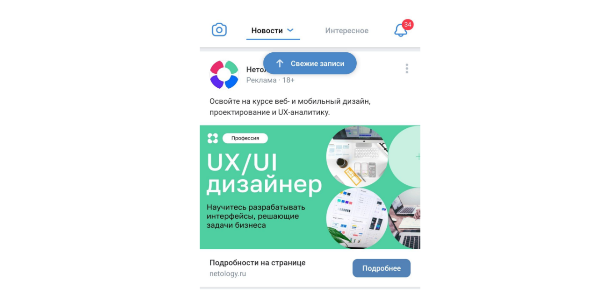

# Домашнее задание к занятию «3.4. Flow»

Выполненное задание прикрепите ссылкой на ваши GitHub-проекты в личном кабинете студента на сайте [netology.ru](https://netology.ru).

**Важно**: ознакомьтесь со ссылками на главной странице [репозитория с домашними заданиями](../README.md).

**Важно**: если у вас что-то не получилось, оформите Issue. [Шаблон для оформления](../report-requirements.md).

## Как сдавать задачи

1. Откройте ваш проект Android-приложения с предыдущего ДЗ (можете брать код из лекции).
1. Сделайте необходимые коммиты.
1. Сделайте пуш. Удостоверьтесь, что ваш код появился на GitHub.
1. Ссылку на ваш проект прикрепите в личном кабинете на сайте [netology.ru](https://netology.ru).
1. Выполните все задачи, чтобы получить зачёт по теме.

## Задача №1. New Posts

### Легенда

[Используйте код и сервер из лекции](https://github.com/netology-code/andin-code/tree/master/11_flow), реализуйте в проекте следующие требования: 

1. Посты, загружаемые в фоне через `getNewer`, не должны отображаться сразу в `RecyclerView`. Вместо этого должна появляться плашка, как в ВКонтакте:

2. При нажатии на плашку происходит плавный скролл `RecyclerView` к самому верху. Должны отображаться загруженные посты. Сама плашка после этого удаляется.

### Реализация
Посмотрите гайдлайны Material Design: есть ли там элементы со схожим поведением. Если есть, используйте их, если нет, предложите свою реализацию.

Подсказки

Самый простой вариант «отображать / не отображать» — это добавить в `Entity` поле и переделать `SELECT` так, чтобы он показывал только те, у которых поле выставлено. Нажав на плашку, вы можете сделать `UPDATE` и выставить поле всем в «показывать»).

Попробуйте предусмотреть реализацию, при которой в `getNewer` не будут запрашиваться посты, которые уже есть у вас в локальной БД. Возможно, вам придётся по-другому считать количество: например, с помощью запроса в БД. Там как раз есть пример с `COUNT`.

### Результат

Опубликуйте изменения в виде Pull Request в вашем проекте на GitHub.

Результат пришлите ссылкой на PR GitHub-проект в личном кабинете студента на сайте [netology.ru](https://netology.ru).
